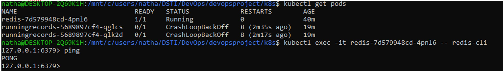

# devopsproject

Subject: This project was created for the DSTI DevOps class project assignment. 
Author: Nathalie Descusse-Brown
Created: 9th May 2022
Updated: 9th July 2022

## Project goals

The goals of the project are to cover the following aspects:
1. Create a web application
2. Apply CI/CD pipeline
3. Configure and provision a virtual environment and run your application using the IaC approach
4. Build Docker image of your application
5. Make container orchestration using Docker Compose
6. Make docker orchestration using Kubernetes
7. Make a service mesh using Istio
8. Implement Monitoring to your containerized application
9. Issues encountered
10. Proposed improvements


## Environment

OS: Windows 11 Home/Pro
Linux SubSystem: WSL
VM: First Ubuntu Desktop 20.04.4 LTS until machine crashed, then replaced by Vagrant Centos/7.
Vagrant on Ubuntu for Windows: v2.2.6
Vagrant on Windows: v2.2.19
Node.js: v14.19.2
redis: v3.1.2

## 1. Create a web application

The application created is a database of running records for most common race distances for men and women categories.

The application connects to Redis database and has the following functionalities:
- Search records
- Add record
- Delete record

The application follows the MVC model, with the index.js being the main file and the controller and router being found in the controllers and routes folders respectively.

Automatic tests for the application were added to cover the following:
- configuration 
- connection
- API

Unit tests as such were not created as I couldn't figure out how to do them with my controller definition.

## 2. Apply CI/CD pipeline

GitHub Actions was used to deploy the model to Heroku, and the fully functioning app can be found at the following url: 
[RunningRecords](https://runningrecords.herokuapp.com/)


## 3. Configure and provision a virtual environment and run your application using the IaC approach

I then set up Vagrant in order to launch a VM to run my app. 

Because of the issue with the below, I tried another approach and ended up succesfully running vagrant with Windows Powershell.

I followed the following steps:
1. Launch wsl from Powershell
2. Navigate to my iac folder (in my instance via ```cd C:\Users\natha\DSTI\DevOps\devopsproject\iac```)
3. Configure vagrant for wsl by running the following commands:
	- export VAGRANT_WSL_ENABLE_WINDOWS_ACCESS="1" export
	- PATH="$PATH:/mnt/c/Program Files/Oracle/VirtualBox" export
	- VAGRANT_WSL_WINDOWS_ACCESS_USER_HOME_PATH=/mnt/c/users/natha/DSTI/DevOps/devopsproject/runningrecords
4. Create vagrant box: ```vagrant box add centos/7```
5. Initialise vagrant: ```vagrant init centos/7```
6. Customize the Vagrantfile to make use of synced folder (to sync with my runningrecords app folder), run Ansible locally and make use of Ansible playbooks.
7. Launch vagrant VM: ```vagrant up```
8. I modified my playbooks each in turn to install node.js and redis and deploy app. Everytime I finished with a playbook I used the command ```vagrant upload playbooks /vagrant/playbooks app_server to update playbooks``` on vagrant, followed by ```vagrant provision```
9. I subsequently checked that my app was indeed running by opening a browser and checking URL http://localhost:8080
10. I then added a healthcheck and from vagrant machine (accessed with ```vagrant ssh```) I ran ```ansible-playbook /vagrant/playbooks/main.yml --tags check -i /tmp/vagrant-ansible/inventory/vagrant_ansible_local_inventory```.


## 4. Build Docker image of your application

I wrote a Dockerfile enabling me to run my app on port 3000 (which is the port node.js runs on)

The Dockerimage was built from the location of the Dockerfile (within my runningrecords app folder) with the following command:

```docker build -t runningrecords .```

The image was subsequently pushed to Docker Hub.


## 5. Make container orchestration using Docker Compose

My application makes use of redis database, so I need a way to enable communication between the redis image and my Docker app image. This can be done via Docker Compose.

In order to implement this I built a docker-compose yaml file that calls the redis:alpine image and my runningrecords app image. Subsequently running the command ```docker compose up``` enables to launch the app on port 7777.

The successful deployment was checked by opening a browser and checking URK http://localhost:7777/


## 6. Make docker orchestration using Kubernetes

In order to deploy my app with Kubernetes with Ubuntu LTS 20.4.4 for Desktop, I followed the following steps:
1. I logged in with docker login
2. I installed minikube
3. I created deployment and service yaml files for redis and my app, and also a persistemvolumeclaim for redis.
4. I then checked that my redis pod was responding:



5. After encountering some issues associated with wsl2 (https://stackoverflow.com/questions/71384252/cannot-access-deployed-services-when-minikube-cluster-is-installed-in-wsl2), I ran ```minikube start --ports=127.0.0.1:31110:31110```

6. I re-ran my -apply for both redis and app:


7. I then checked that my app was indeed deployed:


## 7. Make a service mesh using Istio

Because of issues with Ubuntu (see Section 9), I decided to use vagrant to run istio.

```
vagrant init centos/7
vagrant up
vagrant ssh
```
Once in vagrant machine, I installed minikube:

```
curl -LO https://storage.googleapis.com/minikube/releases/latest/minikube-linux-amd64
sudo install minikube-linux-amd64 /usr/local/bin/minikube
```

I then checked minikube was indeed installed by checking version, which happened to be minikube version: v1.25.2.

In order to use virtualbox as my minikube driver I had to install virtualbox on vagrant by implementing the following: https://phoenixnap.com/kb/how-to-install-virtualbox-centos-7

Faced with the following message when running ```minikube start --ports=127.0.0.1:31110:31110``` 'Exiting due to RSRC_INSUFFICIENT_CORES: Requested cpu count 2 is greater than the available cpus of 1', I add the following lines to my Vagrantfile:

```
  config.vm.provider "virtualbox" do |vb|
  # Customize the amount of memory on the VM:
    vb.memory = "2048"
	vb.cpus = 2
  end
```

## 8. Implement Monitoring to your containerized application

## 9. Issues encountered

### When running vagrant

I followed the following steps to run vagrant from Ubuntu 20.04.4 LTS from Windows 11:
1. Launch Ubuntu for Windows
2. Navigate to my iac folder (in my instance via ```cd /mnt/c/users/natha/DSTI/DevOps/devopsproject/iac```)
3. Configure vagrant for wsl by running the following commands:
	- export VAGRANT_WSL_ENABLE_WINDOWS_ACCESS="1" export
	- PATH="$PATH:/mnt/c/Program Files/Oracle/VirtualBox" export
	- VAGRANT_WSL_WINDOWS_ACCESS_USER_HOME_PATH=/mnt/c/users/natha/DSTI/DevOps/devopsproject/runningrecords
4.	Add vbguest plugin: ```vagrant plugin install vagrant-vbguest```
5.  Create vagrant box: ```vagrant box add centos/7```
6.  Initialise vagrant: ```vagrant init centos/7```
7.  Launch vagrant VM: ```vagrant up```, but this is when I encountered the below issue.

Issue:
I got this error message in the console when running *vagrant up*:
**There are errors in the configuration of this machine. Please fix
the following errors and try again:**

**vm:
* **The host path of the shared folder is not supported from WSL. Host
path of the shared folder must be located on a file system with
DrvFs type. Host path: mnt/c/users/natha/DSTI/DevOps/devopsproject/runningrecords/**

My node.js app is location in folder:  C:/users/natha/DSTI/DevOps/devopsproject/runningrecords/

The issue has been reported to the Adaltas repo: [issue in Adaltas repo](https://github.com/adaltas/dsti-devops-2022-spring/issues/4)

Resolution: I switched from Ubuntu to wsl on Powershell and outcome is described in Section 3.


### With running Ubuntu for Windows

I experience a 'blue screen crash' that subsequently caused some issues when running Kubernetes on Ubuntu 20.04.4 LTS for Windows with Virtualbox for the istio part of the project. This issue is further described in the Adaltas report: [issue in Adaltas repo](https://github.com/adaltas/dsti-devops-2022-spring/issues/5). Despite subsequent efforts, no solution was found so I switched to using vagrant for sake of efficiency.

### Running minikube with vagrant

xxxx


## 10. Proposed improvements / Technical debt

A number of improvements could be made to this project, that were not implemented at this stage due to lack of time. Nonetheless, I believe they would stroingly benefit the project if implemented at a later stage.

### Record ID
Currently there are no restriction made on the format of the recordID each time a new record is entered by a user, which will lead to issues, if no chaos. Ideally the recordID should be a primary key that would self-increment each time a new record is created.