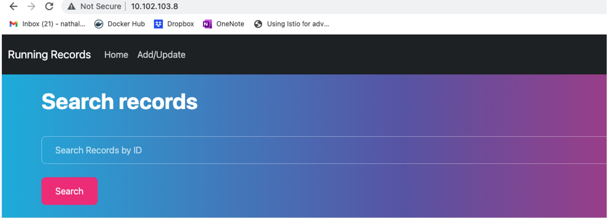
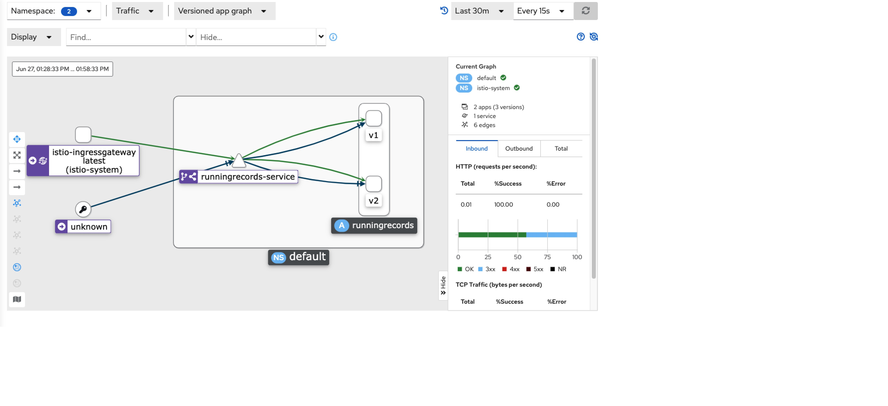

# devopsproject

Subject: This project was created for the DSTI DevOps class project assignment. 
Author: Nathalie Descusse-Brown
Created: 9th May 2022
Updated: 9th July 2022

## Project goals

The goals of the project are to cover the following aspects:
1. Create a web application
2. Apply CI/CD pipeline
3. Configure and provision a virtual environment and run your application using the IaC approach
4. Build Docker image of your application
5. Make container orchestration using Docker Compose
6. Make docker orchestration using Kubernetes
7. Make a service mesh using Istio
8. Implement Monitoring to your containerized application
9. Issues encountered
10. Proposed improvements


## Environment

###All part of project
Node.js: v14.19.2
redis: v3.1.2

###For parts 1-6:
OS: Windows 11 Home/Pro
Linux SubSystem: WSL
VM: First Ubuntu Desktop 20.04.4 LTS until machine crashed, then replaced by Vagrant Centos/7.
Vagrant on Ubuntu for Windows: v2.2.6
Vagrant on Windows: v2.2.19

###For parts 7-8:
OS: Mac OS

## How to Use the runningrecords app

Just enter a record number in the format 'record00x' where x is a single digit, and press 'search.


## 1. Create a web application

The application created is a database of running records for most common race distances for men and women categories.

The application connects to Redis database and has the following functionalities:
- Search records
- Add record
- Delete record

The application follows the MVC model, with the index.js being the main file and the controller and router being found in the controllers and routes folders respectively.

Automatic tests for the application were added to cover the following:
- configuration 
- connection
- API

Unit tests as such were not created as I couldn't figure out how to do them with my controller definition.

I chose to use node.js for the application as I only had knowledge of R and Python before starting the MSc and I wanted to make it challenging and use this project as an opportunity to learn new skills. I followed a number of tutorials (e.g. https://www.youtube.com/watch?v=9S-mphgE5fA) to build a node.js app that connected to redis and followed an MVC model. At this stage, I wanted to build an MVP, and I hope to improve the app in the future with more functionalities (see Section 10).

## 2. Apply CI/CD pipeline

GitHub Actions was used to deploy the model to Heroku, and the fully functioning app can be found at the following url: 
[RunningRecords](https://runningrecords.herokuapp.com/)


## 3. Configure and provision a virtual environment and run your application using the IaC approach

I then set up Vagrant in order to launch a VM to run my app. 

Because of the issue with the below, I tried another approach and ended up succesfully running vagrant with Windows Powershell.

I followed the following steps:
1. Launch wsl from Powershell
2. Navigate to my iac folder (in my instance via ```cd C:\Users\natha\DSTI\DevOps\devopsproject\iac```)
3. Configure vagrant for wsl by running the following commands:
	- export VAGRANT_WSL_ENABLE_WINDOWS_ACCESS="1" export
	- PATH="$PATH:/mnt/c/Program Files/Oracle/VirtualBox" export
	- VAGRANT_WSL_WINDOWS_ACCESS_USER_HOME_PATH=/mnt/c/users/natha/DSTI/DevOps/devopsproject/runningrecords
4. Create vagrant box: ```vagrant box add centos/7```
5. Initialise vagrant: ```vagrant init centos/7```
6. Customize the Vagrantfile to make use of synced folder (to sync with my runningrecords app folder), run Ansible locally and make use of Ansible playbooks.
7. Launch vagrant VM: ```vagrant up```
8. I modified my playbooks each in turn to install node.js and redis and deploy app. Everytime I finished with a playbook I used the command ```vagrant upload playbooks /vagrant/playbooks app_server to update playbooks``` on vagrant, followed by ```vagrant provision```
9. I subsequently checked that my app was indeed running by opening a browser and checking URL http://localhost:8080
10. I then added a healthcheck and from vagrant machine (accessed with ```vagrant ssh```) I ran ```ansible-playbook /vagrant/playbooks/main.yml --tags check -i /tmp/vagrant-ansible/inventory/vagrant_ansible_local_inventory```.


## 4. Build Docker image of your application

I wrote a Dockerfile enabling me to run my app on port 3000 (which is the port node.js runs on)

The Dockerimage was built from the location of the Dockerfile (within my runningrecords app folder) with the following command:

```docker build -t runningrecords .```

The image was subsequently pushed to Docker Hub.


## 5. Make container orchestration using Docker Compose

My application makes use of redis database, so I need a way to enable communication between the redis image and my Docker app image. This can be done via Docker Compose.

In order to implement this I built a docker-compose yaml file that calls the redis:alpine image and my runningrecords app image. Subsequently running the command ```docker compose up``` enables to launch the app on port 7777.

The successful deployment was checked by opening a browser and checking URK http://localhost:7777/


## 6. Make docker orchestration using Kubernetes

In order to deploy my app with Kubernetes with Ubuntu LTS 20.4.4 for Desktop, I followed the following steps:
1. I logged in with docker login
2. I installed minikube
3. I created deployment and service yaml files for redis and my app, and also a persistemvolumeclaim for redis.
4. I then checked that my redis pod was responding:


5. After encountering some issues associated with wsl2 (https://stackoverflow.com/questions/71384252/cannot-access-deployed-services-when-minikube-cluster-is-installed-in-wsl2), I ran ```minikube start --ports=127.0.0.1:31110:31110```

6. I re-ran my -apply for both redis and app:


7. I then checked that my app was indeed deployed:


## 7. Make a service mesh using Istio

Because of issues with Ubuntu and subsequently vagrant on Windows 11 Pro (see Section 9), I decided to borrow a Mac laptop and attempt to finish the project using that machine.

Environment:
Mac OS
Kubernetes v1.24.1
Docker 20.10.16

For this part, I had to create another version of my app. I decided to change the background of my app to make it visually very obvious that there were different versions of the same app.

I had already created the following manifests for the Kubernetes part of the project (see Section 8), so I just had to create the runningrecords-gateway.yml.

The gateway file enables accessing my application from outside the cluster. It also contains a load balancing rule service that defines what percentage of the traffic to send to one version of my app versus the other version.

I started the minikube cluster with only 3.5Gb of memory due to my machine and hence my Docker engine constraints (see Section 9).

The steps taken are as followed:

```
# Environment:
minikube v1.26.0 on Darwin 12.4

# Install minikube and launchset up istio
sudo install minikube-darwin-amd64 /usr/local/bin/minikube
minikube start --driver=virtualbox --ports=127.0.0.1:31110:31110 --memory=4000

# Set up istio
curl -L https://istio.io/downloadIstio | sh -
export PATH=$PWD/bin:$PATH
istioctl install --set profile=demo -y
kubectl label namespace default istio-injection=enabled

# Create two versions of my app, v1 and v2, stored in different folders runningrecords-v1 and runningrecords-v2

# Create deployment and services
kubectl apply -f redis-deployment.yml
kubectl apply -f redis-service.yml
kubectl apply -f redis-volume.yml
kubectl apply -f runningrecords-deployment.yml
kubectl apply -f runningrecords-service.yml

# Creating the gateway to expose app to outside of cluster
kubectl apply -f runningrecords-gateway.yml

# Checking there are no issues with the config
istioctl analyze

# Opening a new command line window and running following
minikube tunnel

# Checking everything is correctly setup
export INGRESS_HOST=$(kubectl -n istio-system get service istio-ingressgateway -o jsonpath='{.status.loadBalancer.ingress[0].ip}')
export INGRESS_PORT=$(kubectl -n istio-system get service istio-ingressgateway -o jsonpath='{.spec.ports[?(@.name=="http2")].port}')
export SECURE_INGRESS_PORT=$(kubectl -n istio-system get service istio-ingressgateway -o jsonpath='{.spec.ports[?(@.name=="https")].port}')
echo "$INGRESS_HOST"
echo "$INGRESS_PORT"
echo "$SECURE_INGRESS_PORT"
export GATEWAY_URL=$INGRESS_HOST:$INGRESS_PORT
echo "$GATEWAY_URL"

# Check ip
kubectl get svc -n istio-system

# Adding Kiala addon
kubectl apply -f samples/addons
kubectl rollout status deployment/kiali -n istio-system

# Launching Kiali dashboard
istioctl dashboard kiali
```





I wanted to try the raw tcp protocol and visualize this traffic alongside more typical http traffic:
- tcp traffic was generated by simply accessing the browser from my machine as redis uses tcp protocol
- http: I generated http traffic by running the command ```for i in $(seq 1 100); do curl -s -o /dev/null "http://$GATEWAY_URL"; done```

Both types of traffic can be visualized in the kiali dashboard:



The split of traffic that we specified (30% going to v1 of app and 70% going to v2 of app) can also be verified in kiali:


However I subsequently noticed that the DELETE function of my app was not working and I suspect it has to do with the configuration of my istio file, but I haven't yet found how to fix it.

## 8. Implement Monitoring to your containerized application

## 9. Issues encountered

### When running vagrant

I followed the following steps to run vagrant from Ubuntu 20.04.4 LTS from Windows 11:
1. Launch Ubuntu for Windows
2. Navigate to my iac folder (in my instance via ```cd /mnt/c/users/natha/DSTI/DevOps/devopsproject/iac```)
3. Configure vagrant for wsl by running the following commands:
	- export VAGRANT_WSL_ENABLE_WINDOWS_ACCESS="1" export
	- PATH="$PATH:/mnt/c/Program Files/Oracle/VirtualBox" export
	- VAGRANT_WSL_WINDOWS_ACCESS_USER_HOME_PATH=/mnt/c/users/natha/DSTI/DevOps/devopsproject/runningrecords
4.	Add vbguest plugin: ```vagrant plugin install vagrant-vbguest```
5.  Create vagrant box: ```vagrant box add centos/7```
6.  Initialise vagrant: ```vagrant init centos/7```
7.  Launch vagrant VM: ```vagrant up```, but this is when I encountered the below issue.

Issue:
I got this error message in the console when running *vagrant up*:
**There are errors in the configuration of this machine. Please fix
the following errors and try again:**

**vm:
* **The host path of the shared folder is not supported from WSL. Host
path of the shared folder must be located on a file system with
DrvFs type. Host path: mnt/c/users/natha/DSTI/DevOps/devopsproject/runningrecords/**

My node.js app is location in folder:  C:/users/natha/DSTI/DevOps/devopsproject/runningrecords/

The issue has been reported to the Adaltas repo: [issue in Adaltas repo](https://github.com/adaltas/dsti-devops-2022-spring/issues/4)

Resolution: I switched from Ubuntu to wsl on Powershell and outcome is described in Section 3.


### With running Ubuntu for Windows

I experience a 'blue screen crash' that subsequently caused some issues when running Kubernetes on Ubuntu 20.04.4 LTS for Windows with Virtualbox for the istio part of the project. This issue is further described in the Adaltas report: [issue in Adaltas repo](https://github.com/adaltas/dsti-devops-2022-spring/issues/5). Despite subsequent efforts, no solution was found so I switched to using vagrant for sake of efficiency.

### Running minikube with vagrant

```
vagrant init centos/7
vagrant up
vagrant ssh
```
Once in vagrant machine, I installed minikube:

```
curl -LO https://storage.googleapis.com/minikube/releases/latest/minikube-linux-amd64
sudo install minikube-linux-amd64 /usr/local/bin/minikube
```

I then checked minikube was indeed installed by checking version, which happened to be minikube version: v1.25.2.

In order to use virtualbox as my minikube driver I had to install virtualbox on vagrant by implementing the following: https://phoenixnap.com/kb/how-to-install-virtualbox-centos-7

Faced with the following message when running ```minikube start --ports=127.0.0.1:31110:31110``` 'Exiting due to RSRC_INSUFFICIENT_CORES: Requested cpu count 2 is greater than the available cpus of 1', I added the following lines to my Vagrantfile:

```
  config.vm.provider "virtualbox" do |vb|
  # Customize the amount of memory on the VM:
    vb.memory = "2048"
	vb.cpus = 2
  end
```

I updated the number of CPUs and re-ran but then I encountered another issue in that the boot of my VM (when running ```vagrant up```) hung when reaching the 'ssh private key' stage of the boot. 
I researched this issue heavily and after a number of hours I came across the following thread: https://forums.virtualbox.org/viewtopic.php?f=6&t=105315

I implemented the fixes suggested and it appeared initially to work in that I could now ssh to my virtual machine.

However, when trying to then run minikube, I encountered the following issue:


No solution was found despite days of significant effort in doing so. I decided to borrow a Mac to try and complete the project.


## 10. Proposed improvements / Technical debt

A number of improvements could be made to this project, that were not implemented at this stage due to lack of time. Nonetheless, I believe they would stroingly benefit the project if implemented at a later stage.

### Record ID
Currently there are no restriction made on the format of the recordID each time a new record is entered by a user, which will lead to issues, if no chaos. Ideally the recordID should be a primary key that would self-increment each time a new record is created.

### App versions
In the future, for the istio part, I will consider making further modifications to the second version of my app to make it more interesting. This time round I wanted to focus on the istio component so decided to keep it the differences minimal whilst obvious to the viewer.

### Docker Desktop memory 
Due to the memory issue encountered when trying to launch kiali dashboard, I had to up the memory on Docker Desktop from the 4Gb it was running on to 5Gb. I could not do much more than than as my borrowed Mac machine was only 8Gb.


### Environment
Given the number of issues encountered with my Windows machine and having to constantly try different fixes as documented above, there is little consistency in versions used throughout the project, which makes it messy, although I tried to document the modifications made as best as possible. In future I will perform everything on a Mac to try and minimise the potential occurrences of issues.